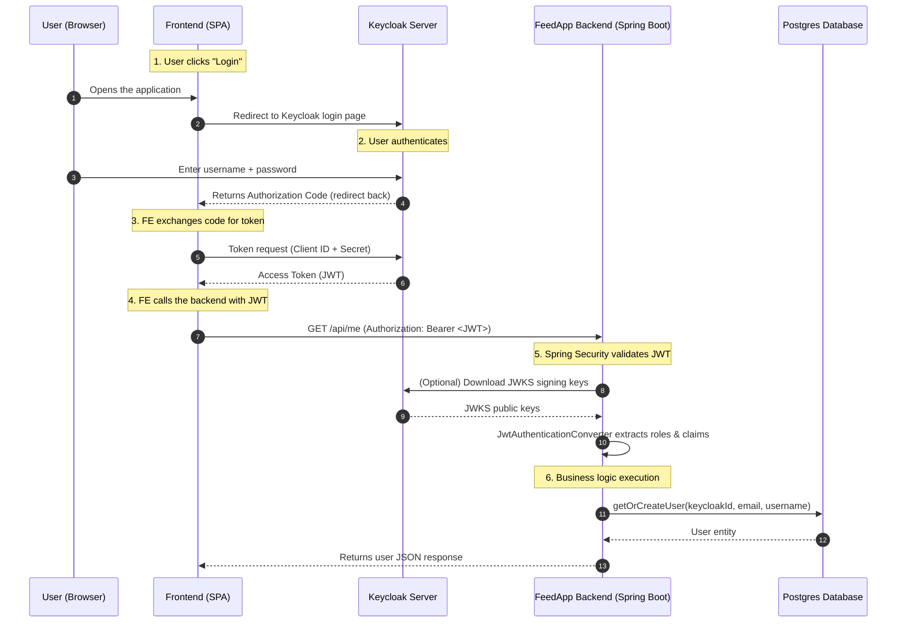

## 🔐 Keycloak Authentication Flow (UML Sequence Diagram)

Below is a Mermaid UML sequence diagram explaining how Keycloak integrates with the FeedApp backend.

### ✔ How GitHub renders this diagram

GitHub supports Mermaid diagrams out of the box.  
To render it:

1. Create or edit any Markdown file (e.g., `README.md`)  
2. Paste the entire code block above  
3. Push it to GitHub  
4. Git

